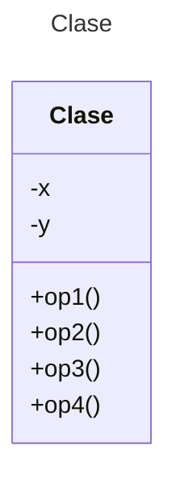

# Proyecto - Notificador (Decorador)

[Página original de este proyecto](https://refactoring.guru/es/design-patterns/decorator)

Imagina que estás trabajando en una biblioteca de notificaciones que permite a otros programas notificar a sus usuarios acerca de eventos importantes.

La versión inicial de la biblioteca se basaba en la clase `Notificador` que solo contaba con unos cuantos campos, un constructor y un único método `send`. El método podía aceptar un argumento de mensaje de un cliente y enviar el mensaje a una lista de correos electrónicos que se pasaban a la clase notificadora a través de su constructor. Una aplicación de un tercero que actuaba como cliente debía crear y configurar el objeto notificador una vez y después utilizarlo cada vez que sucediera algo importante.


En cierto momento te das cuenta de que los usuarios de la biblioteca esperan algo más que unas simples notificaciones por correo. A muchos de ellos les gustaría recibir mensajes SMS sobre asuntos importantes. Otros querrían recibir las notificaciones por Facebook y, por supuesto, a los usuarios corporativos les encantaría recibir notificaciones por Slack (o MSTeams).


No puede ser muy complicado ¿verdad? Extendiste la clase `Notificador` y metiste los métodos adicionales de notificación dentro de nuevas subclases. Ahora el cliente debería instanciar la clase notificadora deseada y utilizarla para el resto de notificaciones.

Pero entonces alguien te hace una pregunta razonable: “¿Por qué no se pueden utilizar varios tipos de notificación al mismo tiempo? Si tu casa está en llamas, probablemente quieras que te informen a través de todos los canales”.

Intentaste solucionar ese problema creando subclases especiales que combinaban varios métodos de notificación dentro de una clase. Sin embargo, enseguida resultó evidente que esta solución inflaría el código en gran medida, no sólo el de la biblioteca, sino también el código cliente.


Debes encontrar alguna otra forma de estructurar las clases de las notificaciones para no alcanzar cifras que rompan accidentalmente un récord Guinness.

## Diagrama de clases
[Editor en línea](https://mermaid.live/)

[Referencia-Mermaid](https://mermaid.js.org/syntax/classDiagram.html)

## Diagrama de clases UML con draw.io
El repositorio está configurado para crear Diagramas de clases UML con ```draw.io```. Para usarlo simplemente das doble clic en el archivo  ```uml.class.drawio.png``` y se activará el editor ```draw.io``` incrustado en ```VSCode``` para edición. Asegúrate de agregar las formas UML en el menú de formas del lado izquierdo (opción ```+Más formas```). Al final insertas el archivo ```uml.class.drawio.png``` en apartado de UML de este archivo README.

## Prompt para generar el Diagrama de Clases con IA - mermAID
```
@mermaid /uml
```

## Uso del proyecto con Maven

### Compilar
```
mvn compile
```
### Probar N tests
```
mvn test
```
### Probar 1 test
```
mvn test -Dtest="AppTest#testEmailNotifier"
mvn test -Dtest="AppTest#testEmailSMSNotifier"
mvn test -Dtest="AppTest#testEmailSMSFacebookNotifier"
mvn test -Dtest="AppTest#testEmailSMSFacebooMSTeamskNotifier"
```
### Ejecutar App
```
java -cp app/target/classes miPrincipal.App
```
### Empacar App
```
mvn package
```
### Limpiar binarios
```
mvn clean
```
### Ejecutar App con Maven
```
mvn exec:java
```
## Comandos Git-Cambios y envío a Autograding

### Por cada cambio importante que haga, actualice su historia usando los comandos:
```
git add .
git commit -m "Descripción del cambio"
```
### Envíe sus actualizaciones a GitHub para Autograding con el comando:
```
git push origin main
```
